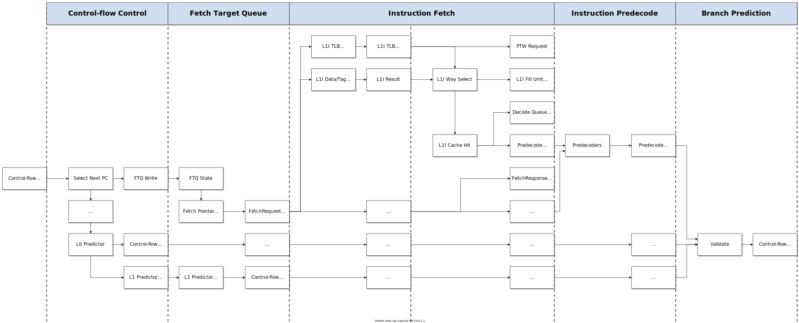

Front-End
=========

In the front-end of the machine, the ultimate goal is to keep a continuous
stream of [relevant] instruction bytes moving into the rest of the machine. 
This involves:

- Determining which instructions need to enter the pipeline
- Prefetching instructions from remote memory into the L1I cache
- Fetching instructions from the L1I cache and sending them down the pipeline

Decoupling
----------

Branch prediction and instruction fetch are decoupled by a 
**fetch target queue** (FTQ) which controls interactions with the L1I cache. 

Control-flow Requests
---------------------

Control-flow requests are *a program counter value* which indicates where the 
front-end should fetch instruction bytes. 
Each request will eventually produce an L1I cacheline (also called a "fetch 
block") which is sent into the rest of the machine. 

The program counter value associated with a request has two components
(assuming 32B L1I cachelines):

- The upper 27 bits are the *fetch block address* which is used to identify a 
  particular L1I cacheline
- The low 5 bits are the *fetch offset* which identifies the first relevant
  32-bit word within the cacheline; this is also called the "entry point"
  into the block

Control-flow requests are generated from various places in the pipeline, 
and may either be **architectural** or **speculative**:

- Requests from predecoded/predicted branches and jumps
- Requests from recognizing an incorrect prediction
- Requests from retired instructions

A **control-flow control unit** (CFC) collects these and controls which 
request[s] are allocated in the FTQ. Incoming requests are also subject to the 
L0 predictors embedded within the CFC. 

Architectural Requests
^^^^^^^^^^^^^^^^^^^^^^

Architectural control-flow requests occur when: 

1. All instructions in a previously-fetched block (containing no control-flow 
   instructions) have retired. The next program counter *must* be the address of 
   the next-sequential fetch block. 

2. A control-flow instruction has retired. The next program counter *must* be
   the address of the resolved target address for the instruction. 

3. A branch misprediction has been recognized. The next program counter *must* 
   be the address of the resolved target address for the predicted branch. 

Speculative Requests
^^^^^^^^^^^^^^^^^^^^

Speculative control-flow requests occur when: 

1. A predecoded fetch block has no control-flow instructions. The next program
   counter is predicted to be the address of the next-sequential fetch block. 

2. A predecoded fetch block has one or more control-flow instructions. 
   The next program counter is the predicted target address for the instruction.

Instruction Fetch
-----------------

Control-flow requests are queued up by a **fetch target queue** (FTQ). 
The FTQ controls two pipes that are used to interact with the L1I cache: 

- The "instruction fetch pipe" dedicated to "demand" fetch requests 
  (the oldest entry in the FTQ)
- The "instruction prefetch pipe" dedicated to prefetch requests

The L1I cache is virtually-indexed and physically-tagged. 
In both pipelines, interactions with the L1I cache are completed and respond 
back to the FTQ after two cycles:

1. The address is sent to the L1I TLB and the L1I cache data/tag arrays
2. A matching tag selects the hitting way; otherwise, a miss condition 
   generates a request to either the PTW or the L1I fill unit which is 
   valid on the next cycle. The status is reported back to the FTQ. 

An L1I cache hit is sent to the decode queue and the predecoders in parallel. 
On a miss condition, the fetch pipe sets up requests to either the PTW or the
L1I fill unit and reports this to the FTQ. The FTQ entry associated with the 
request is parked and waits for a matching response from either the PTW or 
L1I fill unit before being replayed. 

   The instruction fetch pipeline

Branch Prediction
-----------------

The front-end always fetches instructions in the order presented by the 
program. This is complicated by the following facts: 

- Pipelining necessarily involves latency
- Control-flow may depend on data (the architectural state)

Since many branches and jumps must be resolved during runtime, 
their exact effects cannot be definitively known until they have passed all
the way through the back-end of the machine (which may take many cycles). 
This means that the front-end cannot always know the precise order of the 
program in the immediate future. 

To mitigate this, control-flow must be *predicted* as early as possible.
Otherwise, we cannot deliver an uninterrupted stream of instructions to 
the rest of the machine. 

Control-flow is predicted in three fundamentally different but related ways: 

1. We can predict *the existence* of a control-flow instruction within a 
   particular cacheline. 

2. We can predict *the direction* of a conditional branch instruction. 

3. We can predict *the target address* of a control-flow instruction. 

Predecoding
^^^^^^^^^^^

The predecoders identify control-flow instructions and extract immediates from 
words in a successful L1I cache hit. Each predecoder has a full 32-bit adder 
which computes the target addresses for direct branch and jump instructions. 
The predecode unit sends this information to the branch prediction unit. 

Predecoding allows us the following: 

1. We can discover unconditionally-taken control-flow instructions (and their 
   target addresses) immediately after a cacheline has been fetched. 
   This allows us to quickly obtain the next cacheline that must be fetched. 

2. We can discover conditional control-flow instructions immediately after
   a cacheline has been fetched. This allows us to begin predicting the
   branch direction early in the pipeline. 

The next-sequential fetch block can be predicted when the following conditions
are met (and ideally, recognized as early as possible in the pipeline):

- There are no control-flow instructions in the predecoded block
- There are no serializing instructions in the predecoded block
- There are no illegal instructions in the predecoded block

When a predecoded fetch block has a single control-flow instruction, the data
is sent to the appropriate predictor: 

- Since the target addresses of unconditional direct jumps/calls are computed 
  by predecoders, the target address can be used without additional latency 
- Conditional branches are sent to the appropriate direction predictor
- Indirect jumps/calls are sent to the appropriate target predictor

.. note::
    When a predecoded fetch block contains more than one control-flow 
    instruction, we need to make a decision about which instruction should 
    be used to predict control-flow. 

L0 Predictions
^^^^^^^^^^^^^^

The L0 predictors use the program counter value (and information about the 
associated fetch block) to immediately predict the next program counter value.

This amounts to predicting *the existence* of an impending control-flow 
instruction within the block **and** predicting *the target address* of that 
instruction. Otherwise, if no control-flow instruction exists in the block, 
the next effective program counter value is assumed to be the address of the 
next-sequential fetch block. 

.. note::
    We can also imagine cases where a stream of many fetch blocks can be 
    predicted ahead-of-time solely based on the program counter value. 
    By keeping track of how basic blocks are split into fetch blocks, 
    you should be able to determine *sequences* of impending fetch blocks
    ahead-of-time instead of the strategy described here (predicting the 
    stream on a block-by-block basis). 

L0 prediction ensures that a new control-flow request is fed back into the CFC 
each cycle, allowing us to avoid inserting bubbles into the pipeline. 

This is mainly supported by the **L0 branch target buffer (BTB)**: a 
fully-associative storage whose entries correspond to predecoded L1I 
cachelines which contain:

- At least one *unconditionally-taken* control-flow instruction
- At least one *conditional, biased-taken* control-flow instruction

A match in the L0 BTB indicates that the address of the next-fetch cacheline 
is known with very high confidence. 
Relative to other predictors, storage must be small in order to support 
accesses that will complete within a single cycle.

.. note::
    Intuitively, it seems like the following situations can be ("should be able 
    to be") trivially predicted with no latency: 

    1. If the fetch block for the program counter is terminated by an unconditional 
       jump/call, use the cached target address
    2. If the fetch block for this program counter is terminated by a return 
       instruction, use the L0 RAP 
    3. If the fetch block for this program counter is terminated by a *biased-taken*
       conditional branch, use the cached target address

    The strategy for determining which control-flow instruction to use is: 

    1. Find the cacheline in an fully-associative storage
    2. Go to the offset of the entrypoint into the fetch block
    3. Select the first instruction which is unconditionally-taken or predicted-taken
       
    3. Invoke the appropriate L0 predictor
    4. If no instruction is predicted-taken, predict the next-sequential block

